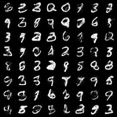

# Normalizing-Flows-PyTorch

Implement Normalizing Flows with PyTorch.

<br/>


## Installation

Clone this repository:

```shell
git clone https://github.com/xyfJASON/normalizing-flows-pytorch
cd normalizing-flows-pytorch
```

Create and activate a conda environment:

```shell
conda create -n flow python=3.11
conda activate flow
```

Install requirements:

```shell
pip install -r requirements.txt
```

<br/>


## NICE

> Dinh, Laurent, David Krueger, and Yoshua Bengio. "Nice: Non-linear independent components estimation." arXiv preprint arXiv:1410.8516 (2014).


### Train

To train on MNIST dataset:

```shell
accelerate-launch scripts/train_nice.py -c ./configs/nice_mnist.yaml -e ./runs/nice-mnist
```


### Test

To compute log-likelihood and bpd (bits per dim):

```shell
accelerate-launch scripts/test_nice.py eval_bpd -c CONFIG --weights WEIGHTS [--bspp BSPP]
```

- `-c`: path to the configuration file
- `--weights`: path to the model weights, e.g., `./runs/nice-mnist/ckpt/best/model.pt`
- `--bspp`: batch size per process

To sample from the model:

```shell
accelerate-launch scripts/test_nice.py sample -c CONFIG --weights WEIGHTS --save_dir SAVE_DIR --n_samples N_SAMPLES [--seed SEED] [--bspp BSPP]
```

- `-c`: path to the configuration file
- `--weights`: path to the model weights, e.g., `./runs/nice-mnist/ckpt/best/model.pt`
- `--save_dir`: directory to save the samples, e.g., `./samples/nice-mnist`
- `--n_samples`: number of samples to generate
- `--bspp`: batch size per process


### Results

|      Dataset       | Log-likelihood |  BPD   |
| :----------------: | :------------: | :----: |
| MNIST (test split) |   -1720.7717   | 3.8335 |

<p align="center">
  
</p>
